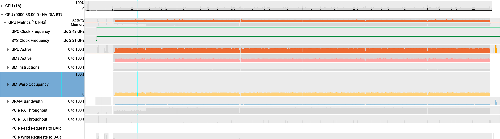
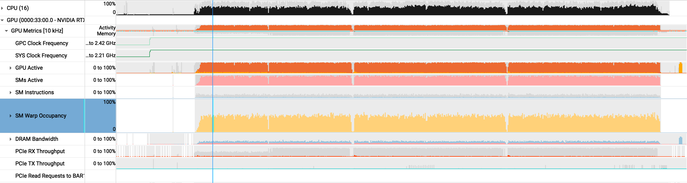

There has been growing interest in GPU query engines over the last two years, notably with the
[Theseus paper](https://arxiv.org/abs/2508.05029),
NVIDIA's [acquisition of HEAVY.AI](https://docs.nvidia.com/heavyai/overview),
and NVIDIA's blog post on [GQE](https://developer.nvidia.com/blog/designing-gpu-accelerated-query-engines-with-nvidia-gqe/).
Naturally, I imagine there's some interest in finding use cases for cheap, outdated GPUs that are too small for
frontier AI.

Recently, I spent a week working on
[libcudf-rs](https://github.com/gabotechs/libcudf-rs), an experimental OLAP
engine built on [Apache DataFusion](https://datafusion.apache.org/) and
Rust bindings for [cuDF](https://github.com/rapidsai/cudf) (huge shoutout to
my colleague and original author [@gabotechs](https://github.com/gabotechs) who recently gave
a [talk](https://www.youtube.com/watch?v=P5v3y1sUMc8) about it). A major goal of the project is
to see whether a GPU instance can offer better performance per dollar than
a CPU-only instance on OLAP workloads.


My goal was to finalize our execution model, keeping in mind two goals:

(a) keep resources (i.e., the GPU) saturated when compute or memory capacity is available; and

(b) schedule work efficiently across three runtimes, reconciling DataFusion's [Volcano-based](https://dl.acm.org/doi/10.1145/93605.98720)
execution model, the Tokio runtime, and the CUDA/cuDF runtime.

## problem: the GPU wasn't saturated

The current execution model used one CUDA stream and one DataFusion partition (analogous to a Tokio task), meaning only
one host thread was feeding the GPU. The GPU could execute only one kernel or
host-to-device copy at a time
(with the sole exception of the cuDF `read_parquet` kernel, which uses streams internally).

{{single_stream_animation}}

The reason we had this simple model was that it was easier to reason about correctness and lifetimes. The safeguards that
Rust has around shared ownership and lifetimes don't really apply to data on the GPU. For example, the
borrow checker and type system cannot detect potential cross-stream dependencies
or ensure that a necessary stream sync happens before reading data on the GPU.

However, as the project matured,
we started looking for the next performance gain, namely in the form of concurrency and parallelism. We wanted to:

(1) efficiently schedule cuDF/GPU operations from the host runtime; and

(2) concurrently run operations on the GPU when it has available resources.

Doing so requires migrating to a multi-task, multi-CUDA-stream model, which I'll dive into below.

## first: stop blocking host threads

Every DataFusion operator produces a `futures::Stream` that polls its input, performs the operation, and
yields a `RecordBatch`. For example, a DataFusion `AggregateExec` implements something like this:

```rust
fn poll_next(mut self: Pin<&mut Self>, cx: &mut Context<'_>) -> Poll<Option<Result<Batch>>> {
    let batch = ready!(self.input.poll_next_unpin(cx));
    let output = aggregate_on_cpu(batch)?;
    Poll::Ready(Some(Ok(output)))
}
```

For our GPU operators, we implemented a simple translation of the above. A `CuDFAggregateExec` is almost the same:

```rust
fn poll_next(mut self: Pin<&mut Self>, cx: &mut Context<'_>) -> Poll<Option<Result<Batch>>> {
    let batch = ready!(self.input.poll_next_unpin(cx));
    let output = aggregate_on_gpu(batch)?; // new: launches a kernel
    Poll::Ready(Some(Ok(output)))
}
```

The problem is that `aggregate_on_gpu` calls into cuDF through FFI. cuDF enqueues kernels asynchronously,
but its APIs are synchronous from the caller's perspective and may sync streams internally for
correctness. This means `poll_next` cannot yield while executing cuDF code, resulting in long polls
that block the calling Tokio executor thread.

I inspected a query using the [Tokio Console](https://github.com/tokio-rs/console) and saw
the issue firsthand. In TPC-H Q1, the root task executing the query was marked busy for 9 of 10 seconds, with
an average poll around 27 ms.

```text
         state   total   busy   sched   idle   polls   avg poll
before    ▶       10s     9s    628ms   36µs     335     ~27ms
```


This meant that for 9 seconds, the executor could not schedule another future on that
worker thread until the call returned.

In [PR #89](https://github.com/gabotechs/libcudf-rs/pull/89), I implemented a
simple fix. Because cuDF calls can block their calling thread, I moved the
GPU aggregate kernel work to Tokio's blocking pool. `spawn_blocking` returns a future,
allowing `poll_next` to return `Pending` while the work
continues on another thread.

```rust
let task = tokio::task::spawn_blocking(move || aggregate_on_gpu(batch));

match Pin::new(task).poll(cx) {
    Poll::Pending => Poll::Pending,
    Poll::Ready(result) => finish(result),
}
```
{{tokio_poll_animation}}

In the Tokio Console, our poll duration improved to `1 ms` and the task was `busy`
for far less time.

```text
         state   total   busy   sched   idle   polls   avg poll
after     ⏸       17s     2s     15s     3ms    1993      ~1ms
```

## second: add tasks and CUDA streams

In CPU land, DataFusion parallelizes a plan in two directions. **Vertical
parallelism** splits the plan into pipelines at operators such as
`RepartitionExec`. When first polled, `RepartitionExec` spawns producer tasks
to drive the pipeline below it, allowing the pipelines above
and below the boundary to run concurrently. **Horizontal parallelism** runs
multiple partitions of each pipeline, with each partition processing a different
slice of the input.

For example, this plan:

```text
SortExec
  AggregateExec
    RepartitionExec
      ProjectionExec
        FilterExec
          DataSourceExec
```

can run as four concurrent tasks: two pipelines/segments, `s0` and `s1`, each with two partitions, `p0` and `p1`.

```text
s0,p0: SortExec <- AggregateExec <- RepartitionExec
s0,p1: SortExec <- AggregateExec <- RepartitionExec

s1,p0: ProjectionExec <- FilterExec <- DataSourceExec
s1,p1: ProjectionExec <- FilterExec <- DataSourceExec
```

[PR #92](https://github.com/gabotechs/libcudf-rs/pull/92) applies a similar
idea to GPU aggregates. It adds an optimizer rule that recognizes an
aggregate over a Parquet scan with pipelineable operators
in between (note that aggregates are pipeline breakers
because they must consume their entire input before emitting a batch). The rule splits
these pipelines into parallel partitions and assigns a non-blocking CUDA stream to each.

### before

```text
Aggregate · single       [1]
  Projection             [1]
    Filter               [1]
      Coalesce       [8 → 1] // everything above this runs in one stream
        Parquet scan     [8]
```

### after

```text
Aggregate · final        [1]
  Coalesce           [8 → 1] // everything below is parallelized on 8 streams
    Aggregate · partial  [8] // per-partition aggregation to reduce the data size
      Projection         [8]
        Filter           [8]
          Parquet scan   [8]
```

The GPU-backed record batches reference the stream they are on, so filters, projections, and partial
aggregates enqueue kernels on the same stream, avoiding
any cross-stream dependencies. Only the final aggregate synchronizes all the streams and merges their partial
results. The final aggregate would have had to wait for its entire input anyway because it's a natural pipeline breaker.

{{multi_stream_animation}}

## results

TPC-H SF100 on a `g7.4xlarge` with an NVIDIA RTX PRO 4500 Blackwell Server Edition
(32 GB, 165 W). These are mean end-to-end query times from the PR.

- **2.53×** — Q15 speedup at 8 streams
- **2.07×** — Q1 speedup at 8 streams
- **1.77×** — Q20 speedup at 2 streams

| query | 1 stream | 2 streams | 4 streams | 8 streams | best speedup |
| --- | ---: | ---: | ---: | ---: | ---: |
| Q1 | 4908 ms | 3526 ms | 2508 ms | **2374 ms** | **2.07×** |
| Q15 | 3182 ms | 1787 ms | 1295 ms | **1256 ms** | **2.53×** |
| Q17 | 7308 ms | **6300 ms** | 6557 ms | 6898 ms | **1.16×** |
| Q18 | 32915 ms | 27895 ms | 24891 ms | **23531 ms** | **1.40×** |
| Q20 | 6002 ms | **3383 ms** | 3402 ms | 3606 ms | **1.77×** |

### the profile tells the same story

An [NVIDIA Nsight Systems](https://developer.nvidia.com/nsight-systems) profile
of Q1 tells the same story. Extra streams turn empty GPU capacity into useful
overlap: the runtime drops by half while all three utilization measures rise
sharply.

- **8% → 47%** — SM warp occupancy
- **20% → 85%** — SM activity
- **37% → 95%** — GPU activity

### before · one stream



### after · eight streams


